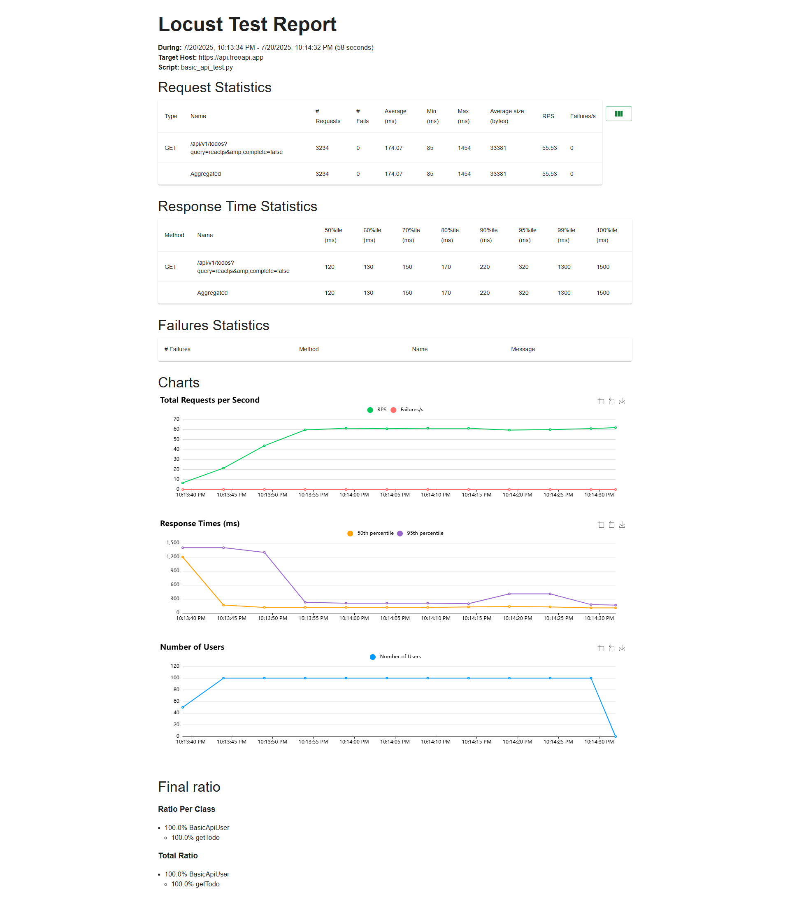
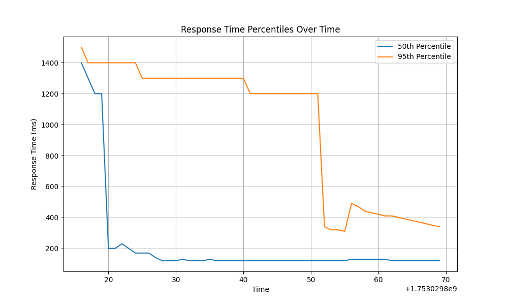

# Locust Performance Testing Framework

## Overview

This framework provides a robust and flexible solution for performance testing various software systems, including APIs, web applications, and custom protocols. Built on top of Locust, a powerful open-source load testing tool, it emphasizes ease of use, automated report generation, and comprehensive documentation.

## Features

*   **API Testing:** Easily define and execute performance tests for RESTful and other API services.
*   **Web Application Testing:** Simulate user behavior for web applications with sequential task sets.
*   **Custom Protocol Support:** Extend the framework to test non-HTTP protocols like gRPC, WebSockets, and database interactions.
*   **Configuration-driven:** Manage test parameters through intuitive YAML configuration files.
*   **Automated Reporting:** Generate detailed HTML and CSV reports, along with custom Markdown summaries and response time plots.
*   **Extensible:** Designed for easy customization and integration with existing CI/CD pipelines.

## Installation

1.  **Prerequisites:**
    *   Python 3.7+
    *   pip (Python package installer)

2.  **Clone the repository:**

    ```bash
    git clone https://github.com/DipankarDandapat/Locust_Framework.git
    cd Locust_Framework
    ```

3.  **Install dependencies:**

    ```bash
    pip install -r requirements.txt
    ```
    *(Note: `requirements.txt` will be created in a later step)*

## Usage

The framework can be executed using the `run_locust.py` script. You can specify test parameters via command-line arguments or a YAML configuration file.

### Running Tests with a Configuration File

This is the recommended approach for managing complex test scenarios and environment-specific settings.

1.  **Create a configuration file:**

    Create a YAML file (e.g., `config/test_config.yaml`) with your test parameters:

    ```yaml
    # config/test_config.yaml
    host: https://api.freeapi.app
    users: 100
    spawn_rate: 10
    run_time: 1m
    locustfile: basic_api_test.py
    report_name: basic_api_test_report
    ```

2.  **Run the test:**

    ```bash
    python run_locust.py --config config/test_config.yaml --headless
    ```
    The `--headless` flag runs Locust without the web UI, which is ideal for automated runs.

### Running Tests with Command-Line Arguments

For quick, ad-hoc tests, you can pass parameters directly via the command line:

```bash
python run_locust.py -f locust_files/basic_api_test.py --host https://api.freeapi.app -u 50 -r 5 -t 30s --headless --csv my_adhoc_test --html my_adhoc_test.html
```

### Available Command-Line Arguments

*   `-f`, `--locustfile`: Path to the Locust test file (e.g., `locust_files/basic_api_test.py`). Required if not specified in the config file.
*   `--host`: Host to test (e.g., `http://localhost:8080`).
*   `-u`, `--users`: Number of concurrent users.
*   `-r`, `--spawn-rate`: Rate at which users are spawned per second.
*   `-t`, `--run-time`: Stop after the specified run time (e.g., `300s`, `20m`, `3h`, `1h30m`).
*   `--headless`: Run Locust in headless mode (without the web UI).
*   `--csv`: Base name for CSV results files (e.g., `basic_api_test_report` will generate `basic_api_test_report_requests.csv`, `basic_api_test_report_failures.csv`, etc.).
*   `--html`: File name for the HTML report (e.g., `basic_api_test_report.html`).
*   `--config`: Path to a YAML configuration file.

## Writing Test Scenarios

Test scenarios are Python files that define user behavior. They are typically placed in the `locust_files/` directory.

### Basic API Test (`locust_files/basic_api_test.py`)

```python
from locust import HttpUser, task, between

class BasicApiUser(HttpUser):
    wait_time = between(1, 2) # Users wait between 1 and 2 seconds between tasks

    @task
    def get_todo(self):
        self.client.get("/api/v1/todos",params={"query":"reactjs","complete":"false"},headers={"accept": "application/json"})

    @task(3) # This task will be executed 3 times more often than others
    def create_todo(self): 
        self.client.post("/api/v1/todos/",json={"description": "dipak","title": "reactjs"},headers={"accept": "application/json","content-type": "application/json"})


```

### Web Browsing Test (`locust_files/web_browsing_test.py`)

This example demonstrates simulating a user browsing a website, visiting different pages sequentially.

```python
from locust import HttpUser, task, between, SequentialTaskSet

class UserBehavior(SequentialTaskSet):
    def on_start(self):
        # This method is called once when a user starts
        self.client.get("/")

    @task(1)
    def view_homepage(self):
        self.client.get("/", name="Homepage")

    @task(2)
    def view_items(self):
        for item_id in range(10):
            self.client.get(f"/item?id={item_id}", name="/item")

    @task(1)
    def view_about_page(self):
        self.client.get("/about", name="About Page")

    @task(1)
    def view_contact_page(self):
        self.client.get("/contact", name="Contact Page")

class WebsiteUser(HttpUser):
    wait_time = between(5, 9) # Users wait between 5 and 9 seconds between task sequences
    tasks = [UserBehavior] # Assign the defined user behavior
```

## Reporting

After each test run, the framework generates several reports in the `reports/` directory:

*   **Locust HTML Report:** A comprehensive HTML report generated by Locust (e.g., `my_api_test_report.html`).
    
*   **Locust CSV Reports:** Raw performance data in CSV format (e.g., `my_api_test_report_requests.csv`, `my_api_test_report_failures.csv`, `my_api_test_report_distribution.csv`).
*   **Custom Markdown Summary:** A `_summary.md` file providing key statistics and failure details.
*   **Response Time Plot:** A `_response_time_distribution.png` image visualizing response time percentiles over the test duration.
     

## Extending the Framework

### Custom Protocol Testing

Locust allows you to test virtually any system or protocol by implementing a custom `User` class and client. For example, to test a gRPC service, you would install `grpcio` and define a custom client within your `User` class.

Example (conceptual):

```python
from locust import User, task, between
import grpc
from my_grpc_proto import my_service_pb2_grpc, my_service_pb2

class GrpcUser(User):
    host = "localhost:50051"
    wait_time = between(1, 2)

    def on_start(self):
        self.stub = my_service_pb2_grpc.MyServiceStub(grpc.insecure_channel(self.host))

    @task
    def call_my_method(self):
        try:
            response = self.stub.MyMethod(my_service_pb2.MyRequest(data="test"))
            # Handle response and report success/failure
            self.environment.events.request.fire(request_type="grpc", name="/MyService/MyMethod",
                                                response_time=100, response_length=len(response.data),
                                                exception=None)
        except Exception as e:
            self.environment.events.request.fire(request_type="grpc", name="/MyService/MyMethod",
                                                response_time=0, response_length=0,
                                                exception=e)
```

## New Test Scenarios

This framework now includes individual and end-to-end performance testing scenarios for the FreeAPI.app Todo API.

### Individual API Tests

- `post_todo_test.py`: This script focuses on testing the performance of the `POST /api/v1/todos` endpoint. It simulates users creating new todo items.
- `get_todo_test.py`: This script tests the performance of the `GET /api/v1/todos/{id}` endpoint. It simulates users retrieving a specific todo item by ID. **Note:** For this individual test, a hardcoded `todo_id` is used. In a real-world scenario, you would typically retrieve existing IDs or use an end-to-end flow.
- `delete_todo_test.py`: This script tests the performance of the `DELETE /api/v1/todos/{id}` endpoint. It simulates users deleting a specific todo item by ID. **Note:** Similar to the GET test, a hardcoded `todo_id` is used for this individual test.

To run any of these individual tests, update your `test_config.yaml` to point to the desired `locustfile` (e.g., `locustfile: post_todo_test.py`) and configure the `host`, `users`, `spawn_rate`, and `run_time` as needed.

### End-to-End API Test

- `end_to_end_todo_test.py`: This script simulates a complete user journey involving the Todo API. It performs the following sequence of actions:
    1. **Create Todo (POST):** A new todo item is created, and its `_id` is captured from the response.
    2. **Get Todo (GET):** The newly created todo item is retrieved using its `_id`.
    3. **Delete Todo (DELETE):** The todo item is then deleted using its `_id`.

This scenario provides a more realistic simulation of user behavior and helps identify performance bottlenecks across multiple API calls.

To run the end-to-end test, set `locustfile: end_to_end_todo_test.py` in your `test_config.yaml`.

**Example `test_config.yaml` for End-to-End Test:**

```yaml
host: https://api.freeapi.app
users: 50
spawn_rate: 5
run_time: 5m
locustfile: end_to_end_todo_test.py
report_name: end_to_end_todo_report
```

## Using Utility Modules in Test Scenarios

To demonstrate how to leverage the newly added utility modules (`authentication.py`, `data_generator.py`, `assertions.py`) within your Locust test scenarios, we have updated some of the example locustfiles.

### `basic_api_test.py` with Assertions

The `basic_api_test.py` now includes assertions to validate the API responses. This ensures that not only are requests being sent, but the responses are also as expected.

```python
from locust import HttpUser, task, between
from utils.assertions import Assertions

class BasicApiUser(HttpUser):
    wait_time = between(1, 2)
    host = "https://api.freeapi.app"

    @task
    def get_todos(self):
        response = self.client.get("/api/v1/todos", params={"query": "reactjs", "complete": "false"}, headers={"accept": "application/json"})
        # Assert that the status code is 200 OK
        Assertions.assert_status_code(response, 200)
        # Assert that the response contains a 'data' field
        Assertions.assert_json_field(response, "data")
```

### `post_todo_test.py` with Data Generation and Assertions

The `post_todo_test.py` now uses the `DataGenerator` to create dynamic todo data and `Assertions` to validate the creation response.

```python
from locust import HttpUser, task, between
from utils.data_generator import DataGenerator
from utils.assertions import Assertions

class PostTodoUser(HttpUser):
    wait_time = between(1, 2)
    host = "https://api.freeapi.app"

    def on_start(self):
        self.data_gen = DataGenerator()

    @task
    def post_todo(self):
        todo_data = self.data_gen.generate_todo_data()
        headers = {"accept": "application/json", "content-type": "application/json"}
        response = self.client.post("/api/v1/todos", json=todo_data, headers=headers)
        # Assert that the status code is 201 Created
        Assertions.assert_status_code(response, 201)
        # Assert that the response contains an "_id" field
        Assertions.assert_json_field(response, "_id")
```

### `get_todo_test.py` and `delete_todo_test.py` with Assertions

Similar to `basic_api_test.py`, the `get_todo_test.py` and `delete_todo_test.py` have been updated to include assertions for status codes, JSON fields, and response times. This ensures robust validation of individual API operations.

### `end_to_end_todo_test.py` with Data Generation and Assertions

The `end_to_end_todo_test.py` now fully utilizes both `DataGenerator` for creating dynamic todo items and `Assertions` for validating each step of the end-to-end flow (create, get, delete).

```python
from locust import HttpUser, task, between
from utils.data_generator import DataGenerator
from utils.assertions import Assertions

class EndToEndTodoUser(HttpUser):
    wait_time = between(1, 2)
    host = "https://api.freeapi.app"
    todo_id = None

    def on_start(self):
        self.data_gen = DataGenerator()

    @task(1)
    def create_todo(self):
        todo_data = self.data_gen.generate_todo_data()
        headers = {"accept": "application/json", "content-type": "application/json"}
        response = self.client.post("/api/v1/todos", json=todo_data, headers=headers, name="Create Todo")
        Assertions.assert_status_code(response, 201)
        Assertions.assert_json_field(response, "_id")
        if "_id" in response.json():
            self.todo_id = response.json()["_id"]
            print(f"Created Todo with ID: {self.todo_id}")
        else:
            print(f"Failed to create Todo: {response.status_code} - {response.text}")

    @task(2)
    def get_todo(self):
        if self.todo_id:
            headers = {"accept": "application/json"}
            response = self.client.get(f"/api/v1/todos/{self.todo_id}", headers=headers, name="Get Todo by ID")
            Assertions.assert_status_code(response, 200)
            Assertions.assert_json_field(response, "_id", self.todo_id)
            Assertions.assert_response_time_less_than(response, 1000)
        else:
            print("No Todo ID available to get.")

    @task(3)
    def delete_todo(self):
        if self.todo_id:
            headers = {"accept": "application/json"}
            response = self.client.delete(f"/api/v1/todos/{self.todo_id}", headers=headers, name="Delete Todo by ID")
            Assertions.assert_status_code(response, 200)
            Assertions.assert_response_time_less_than(response, 1000)
            self.todo_id = None # Reset todo_id after deletion
        else:
            print("No Todo ID available to delete.")
```


